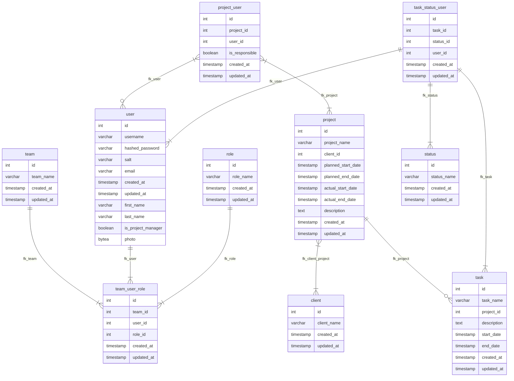

```mermaid
erDiagram
user {
    int id
    varchar username
    varchar hashed_password
    varchar salt
    varchar email
    timestamp created_at
    timestamp updated_at
    varchar first_name
    varchar last_name
    boolean is_project_manager
    bytea photo
}
team {
    int id
    varchar team_name
    timestamp created_at
    timestamp updated_at
}
role {
    int id
    varchar role_name
    timestamp created_at
    timestamp updated_at
}
team_user_role {
    int id
    int team_id
    int user_id
    int role_id
    timestamp created_at
    timestamp updated_at
}
team ||--|{ team_user_role : fk_team
user ||--|{ team_user_role : fk_user
role ||--|{ team_user_role : fk_role
client {
    int id
    varchar client_name
    timestamp created_at
    timestamp updated_at
}
project {
    int id
    varchar project_name
    int client_id
    timestamp planned_start_date
    timestamp planned_end_date
    timestamp actual_start_date
    timestamp actual_end_date
    text description
    timestamp created_at
    timestamp updated_at
}
project_user {
    int id
    int project_id
    int user_id
    boolean is_responsible
    timestamp created_at
    timestamp updated_at
}
project }|--|{ client : fk_client_project
project_user }|--o{ user : fk_user
project_user }|--|{ project : fk_project
task {
    int id
    varchar task_name
    int project_id
    text description
    timestamp start_date
    timestamp end_date
    timestamp created_at
    timestamp updated_at
}
project ||--o{ task : fk_project
status {
    int id
    varchar status_name
    timestamp created_at
    timestamp updated_at
}
task_status_user {
    int id
    int task_id
    int status_id
    int user_id
    timestamp created_at
    timestamp updated_at
}
task_status_user ||--|{ task : fk_task
task_status_user ||--|{ status : fk_status
task_status_user ||--|{ user : fk_user
```
